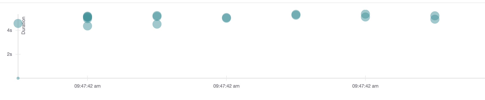
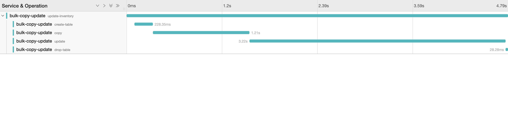

## jdbc-bulk-copy-update

A clojure program to trace and demonstrate bulk copy-and-update statements in postgresql

## Overview

There are real world scenarios where we need to support updating rows in bulk, say, via a CSV file. One such example would be inventory management. The quantity of inventory would need to be updated on a regular basis. The problem comes when you have the store manager uploading a CSV (with updated inventories) to your application server which then needs to update the quantity in the `inventory` table. This CSV could contain as high as 10K items. 
<br><br>
This is an attempt at solving this problem. Instead of sending each update statement one-by-one or constructing a complex query, we can create a temporary table and copy the CSV into the temporary table using JDBC's Copy Manager. Then copy all the data from the temporary table to the `inventory table`. Drop the temporary table.

## Prerequisite

You will need to have docker installed and then run the following command to start `jaegar-all-in-one`

```
docker run -d --name jaeger \
  -e COLLECTOR_ZIPKIN_HTTP_PORT=9411 \
  -p 5775:5775/udp \
  -p 6831:6831/udp \
  -p 6832:6832/udp \
  -p 5778:5778 \
  -p 16686:16686 \
  -p 14268:14268 \
  -p 9411:9411 \
  jaegertracing/all-in-one:1.14
```

You can see the jaegar dashboard in your browser at `http://localhost:16686`

## Usage

The project contains a single file with 3 states - server (http server), tracer (jaegar) and a datasource (next.jdbc). The file has comments to,
 - Start all the 3 states - server, tracer and datasource
 - Create table in the database (the database `bulk_copy_update_test` should be created by you)
 - Create a table called `inventory`
 - Generate master inventory file
 - Copy the master inventory file into table `inventory`
 - Generate test files in a folder `update_csv_files`. Each file contains item_id and the updated quantity separated by a comma. Each of these files contains 50K items.
 - Update inventory using the files in folder `update_csv_files` in a concurrent manner.

After you run the command (last command) to update the inventory table, you can go to `http://localhost:16686` and select the service as `bulk-copy-update`. You should be able to see the traces.





## Http End point

The http server listens at port 8080. The following curl should work
```
curl -XPOST  "http://localhost:8080/file" -F file=@update_csv_files/inventory-update-250001.csv
```

You can run your perf test against the end point and see the traces on jaegar dashboard to look at the performance
